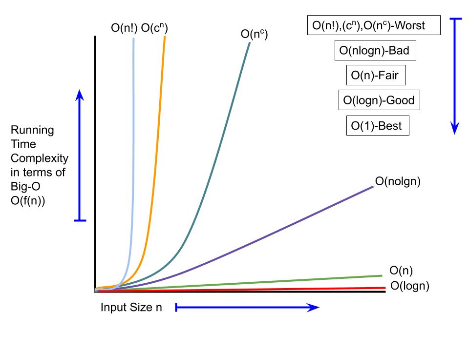

### Time and Space Complexity of Polynomial Arithmetic using Linked list

   - For most of the algorithms associated with this course, time complexity comparisons are more interesting than space complexity comparisons
   - In general though, analysis yield upper bounds rather than exact formulae.
   - Time complexity expresses the relation between the size of the input and runtime for the algorithm
   - Analysis of polynomials using Linked list can be based on:
      1. Number of arithmetic operations performed
      2. Number of comparisons made
      3. Number of array elements accessed

### Best and Worst case of Polynomial using Linked list

    Worst case analysis is used to find an upper bound on algorithm performance for large problems (large n)
    Best case analysis determines the average (or expected) performance Worst case time complexity is usually simpler to work out

### Comparison of Polynomial with other Algorithms

