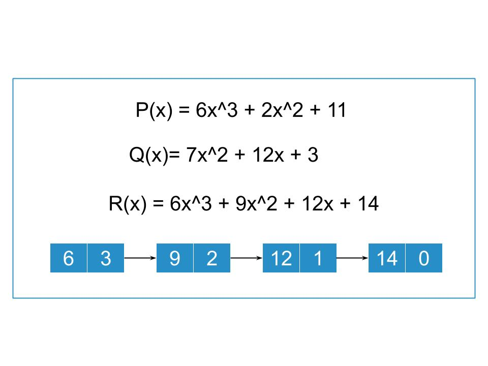

### Addition of Polynomials using Linked list Theory

   - In the polynomial linked list, the coefficients and exponents of the polynomial are defined as the data node of the list.

   - For adding two polynomials that are stored as a linked list. We need to add the coefficients of variables with the same power. In a linked list node contains 3 members, coefficient value link to the next node.

### Polynomial Addition using Linked list

