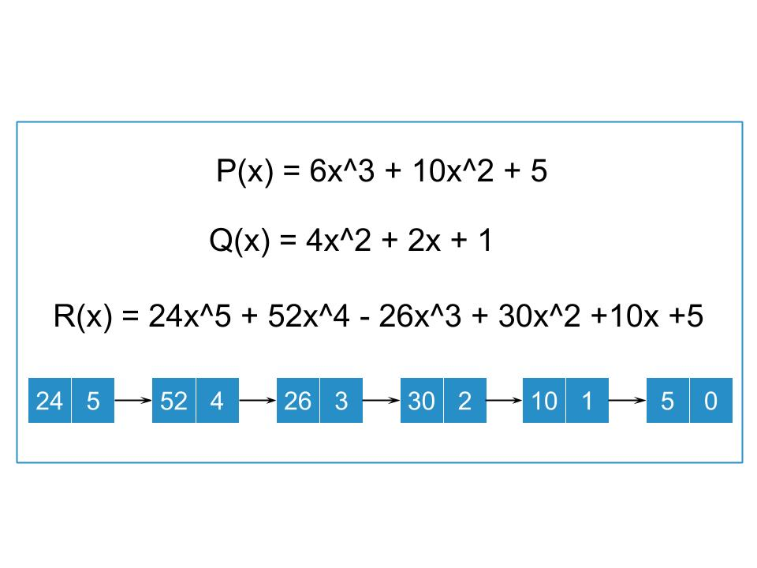

### Multiplication of Polynomials using Linked list Theory

  -  In this approach we will multiply the 1st polynomial with each term of 2nd polynomial.
  -  Store the multiplied value in a new linked list.
  -  Then we will add the coefficients of elements having the same power in resultant polynomial.

 

### Polynomial Multiplication using Linked list

