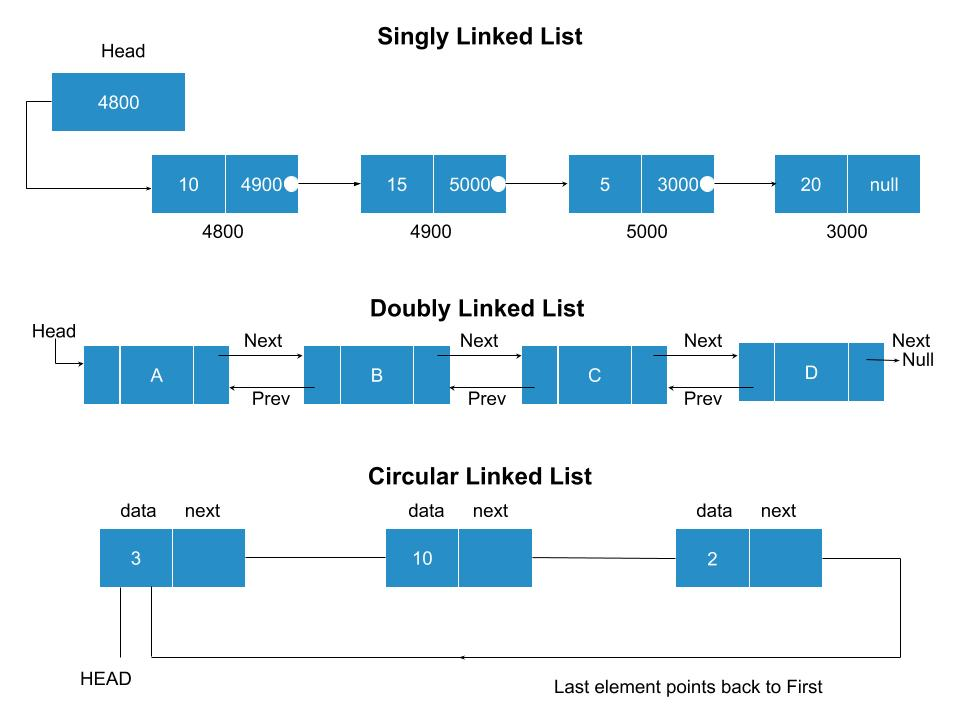

### What is Linked list?

A Linked list consists of nodes where each node contains a data field and a reference(link) to the next node in the list.
### Types of Linked list

  -  Singly Linked list: It contain nodes which have a data part as well as an address part i.e. next, which points to the next node in the sequence of nodes.

  -  Doubly Linked list: In this, each node contains a data part and two addresses, one for the previous node and one for the next node.

  - Circular Linked list: In this, the last node of the list holds the address of the first node hence forming a circular chain.

### Pictorial representation of Linked list

### Estimated Time for Pre Test Quiz

10 minutes
### Instructions for Pre Test Quiz

  -  Pretest includes questions on **Linked list and Polynomials**.
  -  If you want to revise these topics before taking the quiz, go through the Recap module first.
  -  Read the questions in the quiz section and select the correct option from the ones provided. Please note that some **questions may have more than one correct response**.

